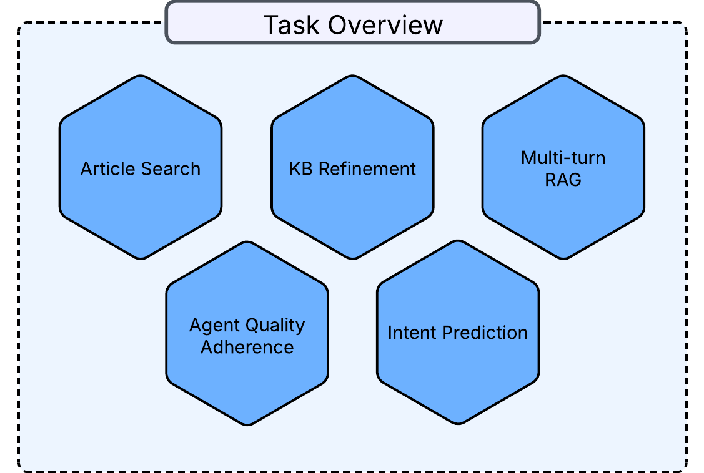

# CXM Arena Evaluation Framework

This repository provides a comprehensive framework for evaluating language models on the [CXM Arena dataset](https://huggingface.co/datasets/sprinklr-huggingface/CXM_Arena), a benchmark suite for Customer Experience Management tasks.

<p align="center">
  
</p>


## Overview

The CXM Arena Evaluation Framework allows you to evaluate models on six key tasks:

1. **Agent Quality Monitoring (AQM)**: Evaluates model's ability to assess agent performance in customer interactions
2. **Contact Driver Identification (CDI)**: Analyzes customer contact reasons and driver classification
3. **KB Refinement**: Tests ability to identify similar and contradictory knowledge base articles
4. **Article Search**: Evaluates retrieval and answer generation capabilities
5. **Multi-turn RAG**: Tests retrieval-augmented generation in multi-turn conversations
6. **Tool Calling**: Assesses model's ability to select appropriate tools in conversations

> **Note**: Although in paper we shared predictions for formatted articles, here we have shared implementation for getting predictions on cleaned txt files.

## Installation

```bash
# Clone the repository
git clone https://github.com/kapilsprinklr/CXMArena
cd CXMArena

# Install dependencies
pip install -r requirements.txt

# Add your Vertex AI credentials
# Create access_forrestor_nlp.json in the root directory with your Google Cloud credentials
```

## Usage

### Basic Example

```python
from cxm_predictor import CXMPredictor
from cxm_evaluator import CXMEvaluator
from cxm_downloader import CXMDataLoader

# Initialize components
data_loader = CXMDataLoader()
predictor = CXMPredictor()
evaluator = CXMEvaluator()

# Select task to evaluate
task_key = "AQM"  # See available tasks below

# Load task-specific data
input_data = data_loader.load(task_key)

# Run prediction and evaluation
results = await predictor.predict(task_key=task_key, inp=input_data)
metrics = evaluator.evaluate(task_key=task_key, inp=input_data, results=results)
```

### Available Tasks

- `AQM`: Agent Quality Monitoring
- `CDI`: Contact Driver Identification 
- `KB_REFINEMENT`: Knowledge Base Refinement
- `ARTICLE_SEARCH`: Article Search
- `TOOL_CALLING`: Tool Calling
- `MULTI_TURN_RAG`: Multi-turn RAG

## Evaluation Metrics

The framework implements specific evaluation metrics for each task:

### Agent Quality Monitoring (AQM)
- **Conversation-level Accuracy**: Proportion of conversations where all questions are answered correctly
- **Question-level Accuracy**: Overall proportion of questions answered correctly across all conversations

### Article Search
- **Precision**: Exact match accuracy for retrieved article IDs

### KB Refinement
- **Precision**: Accuracy of identified article pairs
- **Recall**: Proportion of true pairs that were identified
- **F1 Score**: Harmonic mean of precision and recall

### Contact Driver Identification
- **Exact Match Accuracy**: Accuracy of predicted taxonomy levels

### Tool Calling
- **Tool Selection Accuracy**: Exact match precision for tool selection

### Multi-turn RAG
- **Retrieval Recall**: Proportion of relevant knowledge articles retrieved
- **Response Quality**: Evaluation of response quality considering conversation context and retrieved knowledge

## Model Support

The framework currently supports:
- Gemini models through Vertex AI (e.g., gemini-1.5-pro, gemini-2.0-flash)
- Custom embedding models for retrieval tasks (e.g., multilingual-e5-large-instruct)


## License

This project is licensed under the [Creative Commons Attribution-NonCommercial 4.0 International License (CC BY-NC 4.0)](https://creativecommons.org/licenses/by-nc/4.0/). This license permits sharing and adapting the work, provided it's not used for commercial purposes and appropriate credit is given.

## Citation

If you use this framework or the CXM Arena dataset in your research, please cite:

```bibtex
@misc{spinklr_cxm_arena_2025,
  title        = {CXM Arena: A Unified Benchmark for Customer Experience Management Tasks},
  author       = {{Spinklr AI}},
  year         = {2025},
  note         = {A consolidated dataset synthetically generated using Gemini-2.0-flash and GPT-4o, encompassing tasks for agent quality adherence, KB refinement, article search and comprehension, intent prediction, and multi-turn RAG with tools. CC BY-NC-4.0.},
  url          = {https://huggingface.co/datasets/sprinklr-huggingface/CXM_Arena}
}
```